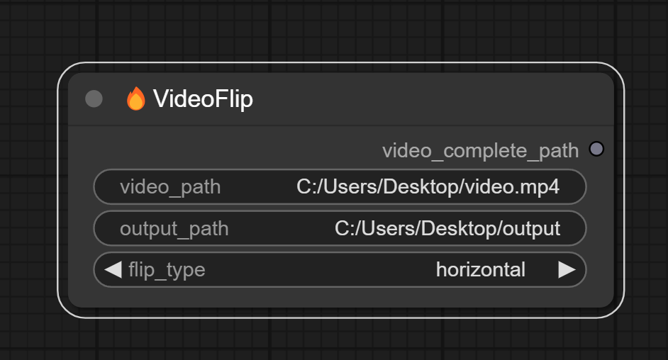
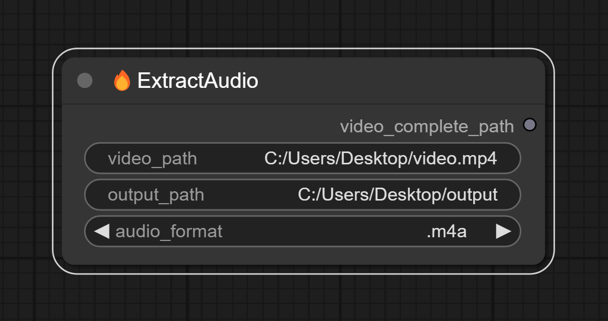

<h1 align="center">ComfyUI-FFmpeg</h1>

      English | <a href="README.md">中文</a>

## Introduction

Encapsulate the commonly used functions of FFmpeg into ComfyUI nodes, making it convenient for users to perform various video processing tasks within ComfyUI. 

## Tips

You need to install FFmpeg before using this node, the FFmpeg installation method can refer to [here](https://www.bilibili.com/read/cv28108185/?spm_id_from=333.999.0.0&jump_opus=1)

## Installation 

#### Method 1:

1. Go to comfyUI custom_nodes folder, `ComfyUI/custom_nodes/`
2. `git clone https://github.com/MoonHugo/ComfyUI-FFmpeg.git`
3. `cd ComfyUI-FFmpeg`
4. `pip install -r requirements.txt`
5. restart ComfyUI

#### Method 2:
Directly download the node source package, then extract it into the custom_nodes directory, and finally restart ComfyUI.

#### Method 3：
Install through ComfyUI-Manager by searching for 'ComfyUI-BiRefNet-Hugo' and installing it.

## Nodes introduction

##### Video2Frames Node: The function is to convert a video into images and save them to a specified directory. 

###### Parameter Description
**video_path**: The local video path, e.g.：`C:\Users\Desktop\222.mp4` 
**output_path**: The path to save the output images, e.g.：`C:\Users\Desktop\output` 
**frames_max_width**: This parameter can be used to resize the video. The default value is 0, which means the video will not be resized. If frames_max_width is larger than the actual width of the video, the video will not be enlarged and will retain its original width. If frames_max_width is smaller than the actual width of the video, the video will be scaled down.

___

##### Frames2Video Node: The function is to convert images into a video and save it to a specified directory. 

###### Parameter Description
**frame_path**: local image path, e.g.:`C:\Users\Desktop\output` 
**fps**: video frame rate, default is`30` 
**video_name**: saved video name, e.g.:`222.mp4` 
**output_path**: video save path,e.g.:`C:\Users\Desktop\output` 
**audio_path**: video audio path,e.g.:`C:\Users\Desktop\222.mp3` 
___

##### AddTextWatermark Node: The function is to add a text watermark to the video. 

###### Parameter Description
**video_path**: local video path,e.g.:`C:\Users\Desktop\222.mp4` 
**output_path**: video save path,e.g.:`C:\Users\Desktop\output` 
**font_file**: font file: The font file needs to be placed in the`custom_nodes\ComfyUI-FFmpeg\fonts` directory. Not only English fonts, but Chinese fonts can also be used.,e.g.:`ComfyUI\custom_nodes\ComfyUI-FFmpeg\fonts\Alibaba-PuHuiTi-Heavy.ttf` 
**font_size**: watermark text size,e.g.:`40` 
**font_color**: watermark text color,e.g.:`#FFFFFF` or `white` 
**position_x**: watermark text x-coordinate,e.g.:`100` 
**position_y**: watermark text y-coordinate,e.g.:`100` 

___

##### AddImgWatermark Node: The function is to add an image watermark to the video. 

###### Parameter Description
**video_path**: local video path,e.g.:`C:\Users\Desktop\222.mp4` 
**output_path**: video save path,e.g.:`C:\Users\Desktop\output` 
**watermark_image**: watermark image path,e.g.:`C:\Users\Desktop\watermark.png` 
**watermark_img_width**: watermark image width,e.g.:`100` 
**position_x**: watermark image x-coordinate in the video,e.g.:`100` 
**position_y**: watermark image y-coordinate in the video,e.g.:`100` 
___

##### VideoFlip Node: The function is to flip the video 

###### Parameter Description
**video_path**: local video path,e.g.:`C:\Users\Desktop\222.mp4` 
**output_path**: video save path,e.g.:`C:\Users\Desktop\output` 
**flip_type**: Flip type, e.g. `horizontal` horizontal flip, `vertical` vertical flip, `both` horizontal plus vertical flip 

___

##### ExtractAudio Node：The purpose is to extract the audio from the video 

###### Parameter Description
**video_path**: local video path,e.g.:`C:\Users\Desktop\222.mp4` 
**output_path**: video save path,e.g.:`C:\Users\Desktop\output` 
**audio_format**: Save audio formats, including **.m4a** , **.mp3** , **.wav** , **.aac** , **.flac** , **.wma** , **.ogg** , **.ac3** , **.amr** , **.aiff** , **.opus** , **.m4b** , **.caf** , **.dts** etc.  

## Social Account Homepage
- Bilibili：[My BILIBILI Homepage](https://space.bilibili.com/1303099255)

## Acknowledgments

Thanks to all the contributors of the FFmpeg repository. [FFmpeg/FFmpeg](https://github.com/FFmpeg/FFmpeg)

## Star history

